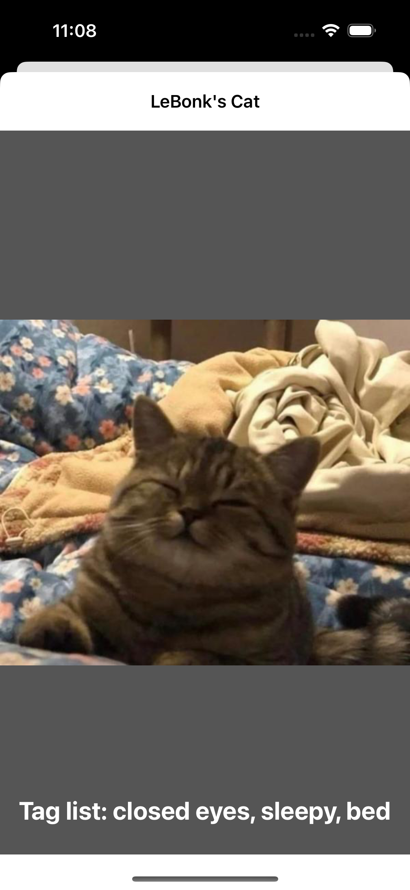

# InternetCats

Barebones demo on how to read the CAAS API and display those sweet, sweet cat pics.




## API Pitfalls
I originally wanted to display small thumbnail versions of the cats in a large grid. The API allows you to specify a width parameter for images, but your width request generates the image on the fly. This causes the response time for a thumbnail version of a GIF to take exponentially longer than just downloading the full size image.

Some of the resized gifs also get garbled:

How could this be fixed? I personally would use [ImageMagick](https://imagemagick.org/) to coalesce the frames, then resize the GIF, then call ```OptimizeImageTransparency``` to restore the fram-by-frame transparency for the GIF. I believe the GIF is being resized and the transparencies are not being updated to reflect the frame size change - causing an odd ghosting effect.

As of 12/18/22 I experienced unexpected behavior trying to get paged results. You would expect the below URL to return images 10 - 20, but instead it returns 1000 images. As a result, paging does not necessarily work as expected, but it does technically work... it just gives you the next thousand images.
```https://cataas.com/api/cats?limit=10&skip=10```
The project maintainer does warn "Cataas is in under recovery mode" ¯\_(ツ)_/¯

## Libraries Used
* [Nuke](https://github.com/kean/Nuke)
Probably my favorite image loader that handles downloading and caching.
* [FLAnimatedImage](https://github.com/Flipboard/FLAnimatedImage)
Battle tested, pretty good GIF displaying engine.
* [IQKeyboardManager](https://github.com/hackiftekhar/IQKeyboardManager)
Abstracts the absolute job it is to add a "Done" button to the iOS keyboard.


Happy coding!